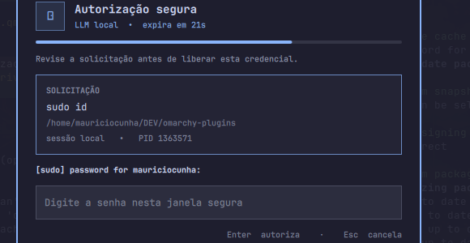

# Doorman

**Local, human-approved `sudo` for background AI agents.**

Doorman is an [Omarchy](https://omarchy.org) plugin for people who run coding
agents (Claude Code, Codex, or anything else that can drive a shell) in
background sessions they aren't watching. When one of those agents needs
`sudo`, there's usually no terminal in front of you to type a password into —
and handing the agent your password so it can type it itself defeats the
point of having one. Doorman puts a human decision in between: the agent's
request shows up in a small, local, keyboard-first window only you can see,
and the password never travels anywhere else — not to the agent, not to the
chat transcript, not to a log file.



## Why this exists

Agentic coding tools are increasingly good at running real commands, and
real commands sometimes need root. The usual answers are all
unsatisfying for local dev work:

- **Give the agent passwordless `sudo`** — fast, but now anything the agent
  runs (including a bug in the agent, or a prompt injection from something
  it read) has unrestricted root.
- **Type the password into the agent's own prompt** — the agent (and
  whatever logs its transcript) now has your password.
- **Babysit every session with a visible terminal** — defeats the purpose of
  running things in the background.

Doorman decouples *where a command asks for a password* from *where you type
it*. The requesting process calls the standard `sudo askpass` protocol; a
small local broker holds the request open and shows it to you; you type the
password into a window the agent has no access to; only that specific,
already-decided-and-verified process gets the secret, once, and only through
that broker connection. If you don't respond, or you're not the person who
actually ran the command, or you hit Escape — it fails closed.

## How it works

```
requesting process (sudo -A)
        │
        ▼
   askpass helper  ──(local Unix socket, token + capability)──►  broker
                                                                      │
                                                       shows the request in
                                                             a Quickshell modal
                                                                      │
                                                              you approve / cancel
                                                                      │
        ◄──────────────────────── secret, once ───────────────────────┘
```

- The **broker** is a small Python service that owns a private Unix socket
  (`0600`, under a `0700` runtime directory). It never writes the secret to
  disk, a log, or its own stdout.
- Every request carries a random `request_id` and a high-entropy `nonce`,
  expires in 1–300 seconds, and can be consumed exactly once. The broker
  re-validates the requesting process's PID, UID, start time, and command
  line at the moment of approval — not just when the request was created —
  so a PID that's been reused or a process whose identity changed can't
  slip through.
- The **UI** is a Quickshell overlay: a topbar widget for status/history, and
  a modal that grabs keyboard focus, shows exactly what's being authorized
  (command, working directory, PID, terminal), counts down the time left to
  decide, and sends a desktop notification if you're looking at a different
  monitor.
- Approving, cancelling, or letting a request expire are the only three
  outcomes. There is no fourth path where the secret leaks sideways.

See [`SPEC.md`](SPEC.md) for the full protocol, threat model, and the
reasoning behind each security property — including the DoS and timing bugs
we found and fixed while building this.

## Installing

Doorman has two parts: the **plugin**, an Omarchy bar widget, and the
**broker**, a `systemd --user` service. `omarchy plugin add` handles the
first; the broker and the `sudo` wrapper are one step each, by hand.

```bash
# 1. Add and enable the plugin — validates the manifest, clones it into
#    ~/.config/omarchy/plugins/mauricio.doorman as a git checkout, and
#    places the bar widget without a full shell restart.
omarchy plugin add https://github.com/MauricioMCunha/omarchy-doorman.git --enable

# 2. Install and enable the broker service (omarchy plugin add only manages
#    the bar widget, not systemd units)
cp ~/.config/omarchy/plugins/mauricio.doorman/packaging/omarchy-doorman.service \
  ~/.config/systemd/user/
systemctl --user daemon-reload
systemctl --user enable --now omarchy-doorman.service

# 3. One-time, root-privileged: install the askpass helper that actually
#    receives the password (SPEC.md §6.11). The broker refuses every sudo
#    request until this has been run — see "Why this step needs root"
#    below for what it's protecting against.
sudo ~/.config/omarchy/plugins/mauricio.doorman/scripts/doorman-install-askpass

# 4. Shadow `sudo` for this user so agents pick it up without any
#    per-agent configuration — see "Wiring up sudo" below for why this
#    step is the one that actually makes Doorman useful.
ln -s ~/.config/omarchy/plugins/mauricio.doorman/scripts/doorman-sudo ~/.local/bin/sudo
```

Nothing here replaces `/usr/bin/sudo`, edits `sudoers`, or touches anything
under `/usr/share/omarchy/`. Step 3 is the one exception to "everything else
is unprivileged": it installs one small binary, owned by root and not
writable by this user, outside this plugin's own git checkout (so `omarchy
plugin update` never touches it) — see **Why this step needs root** below.
Every step is explicit and reversible — see **Activating, updating, and
removing** below for the inverse of each one.

### Why this step needs root

`sudo` lets *whoever calls it* choose the `SUDO_ASKPASS` helper. Nothing
stops a background agent from invoking real `sudo` directly (bypassing
Doorman's own `sudo` shadow entirely) and pointing `SUDO_ASKPASS` at a
script it wrote itself — which would still look, to the broker, exactly
like a legitimate request, and would receive the real password once a
human approved it. Closing that needs an identity an ordinary, same-user
process cannot fake: a binary installed once by root, at a fixed path this
user cannot write to or even read (only execute), which hands the broker a
file descriptor for its own executable so the broker can confirm — without
needing any special permission over the process that sent it — that it
really is that exact file. The install step also grants that one binary a
narrow Linux file capability (`cap_dac_read_search`) so it can read its own
executable content despite not being readable by this user — without it,
mode `0711` would block the legitimate helper from reading itself, not just
an attacker's forgery. See
[`SPEC.md` §6.11](SPEC.md#611-the-askpass-helper-itself-must-carry-an-identity-it-cant-fake)
for the full reasoning, including why three earlier versions of this check
(one group-based, one that had the broker inspect the connecting process
directly, one that assumed reading your own executable needs no
permission) turned out not to work.

### Activating, updating, and removing

The plugin and the broker are independent: toggling one doesn't touch the
other, and nothing below deletes your session token or metrics unless you
run the removal block at the end.

```bash
# Toggle the bar widget on/off, without touching the installed files
omarchy plugin disable mauricio.doorman
omarchy plugin enable mauricio.doorman

# Stop/resume the broker, without touching the installed files
systemctl --user stop omarchy-doorman.service
systemctl --user start omarchy-doorman.service

# Pull the latest plugin code (it's a git checkout) and restart the broker
# to pick up any broker/ changes — the bar widget's QML hot-reloads on its
# own, the broker does not.
omarchy plugin update mauricio.doorman
systemctl --user restart omarchy-doorman.service

# Remove everything, in order. Check the sudo shadow symlink BEFORE
# deleting the plugin folder it points into — in case you reused
# ~/.local/bin/sudo for something else since installing, this only removes
# it if it's still exactly doorman-sudo.
[ "$(readlink -f ~/.local/bin/sudo 2>/dev/null)" = "$(readlink -f ~/.config/omarchy/plugins/mauricio.doorman/scripts/doorman-sudo 2>/dev/null)" ] \
  && rm -f ~/.local/bin/sudo
# Disables and unloads the widget, then backs up (or deletes, since this
# is a git checkout) the plugin folder.
omarchy plugin remove mauricio.doorman --yes
systemctl --user disable --now omarchy-doorman.service
rm -f ~/.config/systemd/user/omarchy-doorman.service
systemctl --user daemon-reload

# The root-installed askpass helper is the only state that lives outside
# the plugin folder and the per-user runtime dir — removed separately, and
# only if you're not keeping Doorman around for another user on this
# machine.
sudo rm -rf /usr/local/lib/omarchy-doorman
```

### Wiring up `sudo`

The whole point of Doorman is that an agent shouldn't need to know it
exists. If it only intercepts `sudo` calls that were deliberately routed
through a wrapper, it's back to being a personal habit, not something that
protects anyone who installs it from the catalog without also editing every
agent's own instructions.

`sudo` itself won't cooperate here: given a real terminal to prompt on, it
prefers that terminal over `SUDO_ASKPASS` regardless of what's in the
environment — `-A` has to be passed explicitly, every time, by whatever
calls `sudo`. Since agents (and plain scripts) almost always resolve `sudo`
by name rather than by absolute path, the fix is to make sure they resolve
*Doorman's* `sudo` first:

```bash
# Recommended: shadow `sudo` for this user's own shells only.
# ~/.local/bin generally precedes /usr/bin in PATH already (Omarchy ships
# this by default); this does not touch /usr/bin/sudo, sudoers, or any
# other user's environment.
ln -s ~/.config/omarchy/plugins/mauricio.doorman/scripts/doorman-sudo ~/.local/bin/sudo
```

With that in place, plain `sudo <command>` — typed by you, or run by an
agent in a background job or a terminal it opened itself — resolves to the
wrapper, which always forwards to the real `sudo -A` unless the caller
already passed `-A`/`-S`/`-n`/`--stdin`/`--non-interactive` explicitly. The
one thing this can't catch is a caller that hardcodes `/usr/bin/sudo` by
absolute path, bypassing `PATH` resolution entirely — but since the askpass
identity check (§6.11), that no longer means the secret leaks: a caller
that bypasses the wrapper still can't make its own `SUDO_ASKPASS` receive
the password, so the residual gap is UX only (no friendly retry labeling,
no `DOORMAN_COMMAND` hint) — see
[`SPEC.md`](SPEC.md#7-known-limitations).

Other integration points still exist for narrower cases:

```bash
# One-off, for a single external command, without shadowing sudo at all:
scripts/doorman-run -- sudo systemctl restart some-service

# Or point SUDO_ASKPASS at the installed helper directly, the way a real
# `sudo -A` invocation (or an agent's own shell) would:
export SUDO_ASKPASS=/usr/local/lib/omarchy-doorman/doorman-askpass
sudo -A whoami
```

That installed path is the only `SUDO_ASKPASS` target the broker will
accept in production (SPEC.md §6.11) — only root's install step can put a
file there, not the plain `askpass.py` in the plugin folder. `askpass.py`
still exists, but only as a dev/test fixture: pointing `SUDO_ASKPASS` at
it gets `untrusted_askpass_helper`, by design.

## What Doorman is not

- Not a secrets vault, and not a password manager. It relays one password,
  once, to one already-verified process.
- Not a keylogger-proofing tool, a sandbox, or a replacement for `sudoers`
  policy — it's a human-in-the-loop gate in front of the normal `sudo`
  mechanism.
- Not (yet) audited by anyone other than the people who built it. See the
  status note below before trusting it with anything that matters.

## Project status

Doorman is in **private beta**: solid enough for the exact workflow it was
built for (local dev machine, one user, background coding agents), not yet
reviewed by anyone outside the project. Current gaps before a wider release:

- CI runs the Python test suite, a compile check, and a secret scan on every
  push; `qmllint` still runs manually (see below) — GitHub-hosted runners
  don't have Quickshell/Omarchy installed, and there's no package for either.
- Tested live against a real Quickshell/Omarchy session and real `sudo` — bar
  widget, popup, the approval modal, and a full `sudo` round trip through the
  wrapper all exercised end to end — but only on an existing, already-set-up
  account. Not yet tested from a clean one: fresh `omarchy plugin add`,
  shell reload, broker toggle, approval, cancellation, expiry, removal, and
  rollback, all on an account that never had Doorman on it before.
- Threat model and plugin lifecycle haven't had an independent review.

None of that changes what's already true today: the secret never leaves the
approval path, every request is single-use and identity-checked, and the
broker fails closed on anything it can't verify.

## Development

```bash
python3 -m unittest discover -s tests -p 'test_*.py'
python3 -m py_compile broker/*.py *.py
git diff --check
scripts/qmllint-check  # needs a local Omarchy/Quickshell install
```

The test suite covers authentication, invalid origin, missing/mismatched
PID, expiry, approval, replay, wrong nonce, cancellation, the askpass helper,
process-identity changes, the idle-connection DoS fix, and the concurrent-
request cap. See [`SPEC.md`](SPEC.md#acceptance-criteria) for the full list
mapped to requirements.

## License

MIT. See [`LICENSE`](LICENSE).
